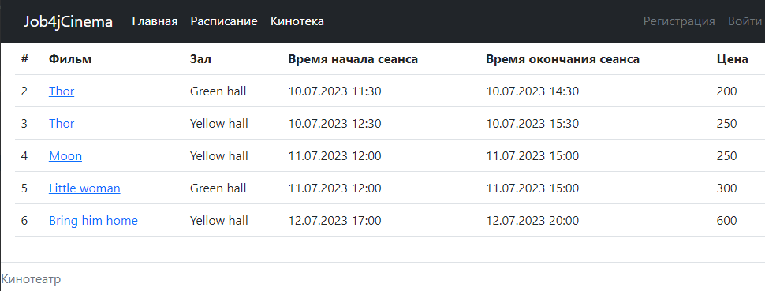

# **Сервис Кинотеатр**

## _Описание:_

Данное приложение разработано для автоматизации покупки билетов в кинотеатр. 
Сервис позволяет забронировать билет в разрезе фильма, зала, а также ряда и места в нем, при этом обеспечивается контроль повторной покупки.
Поддерживается регистрация и хранение данных пользователя (логин, электронная почта и пароль).

## _Стек технологий:_
Java 17

Spring Boot 3.0.5

HTML 5

Thymeleaf 3.0.5

BOOTSTRAP 4.4.1

Liquibase 4.15.0

sql2o 1.6.0

H2 2.1.214

Mockito 3.5.13

Junit 5

## _Требования к окружению:_
Java 17
Maven 3.8
PostgresSQL 14

## _Запуск проекта:_
Для иницаилизации проекта необходимо выполнить команды:
создание схемы БД:

```create database cinema;```

Запуск проекта:

```mvn spring-boot:run```


## _Взаимодействие с приложением:_

Главная страница - общая информация о ресурсе:


Кинотека. Список фильмов:


Расписание - сеансы и связанные с ними фильмы. При выборе конкретного сеанса пользователь переходит на страницу покупки билета:


Страница покупки билета - информация о сеансе и фильм. Также 2 выпадающих списка - один для указания ряда, другой для указания места, и кнопки покупки: 


Страница с результатом успешной покупки билета. 


Страница с результатом неудачной покупки билета (билет уже купили). 


Страница входа. Если пользователь не зарегистрирован и нажимает на кнопку "Купить билет", то его перебрасывает на страницу входа:


Страница регистрации.


Все пользователю имеют право просматривать информацию на сайте, при этом только зарегистрированные пользователю могут покупать билеты. 

## _Контакты разработчика:_
### **dafonichkin@gmail.com**